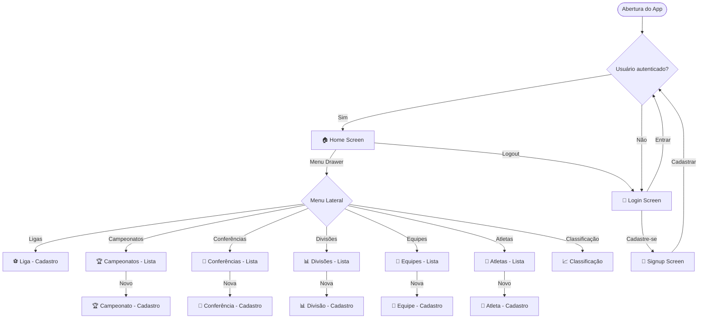
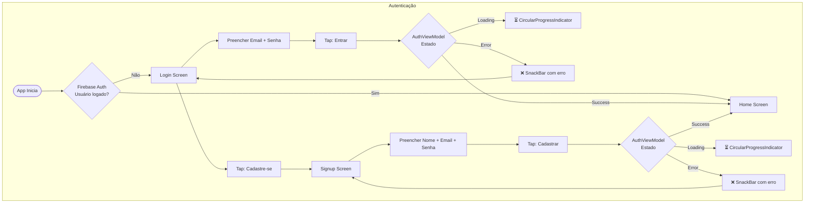
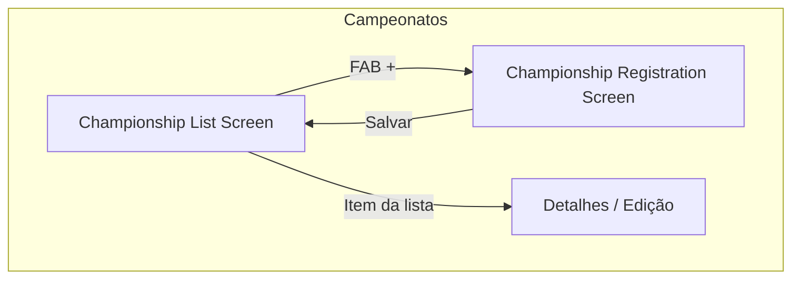
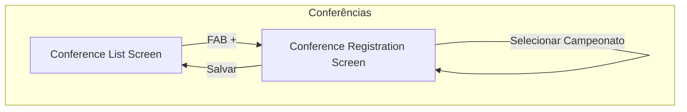
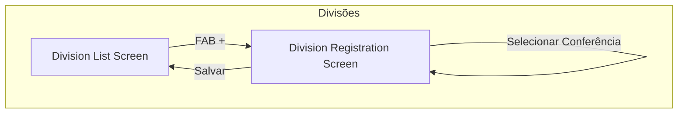
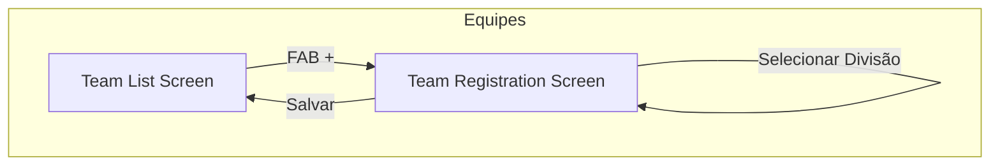
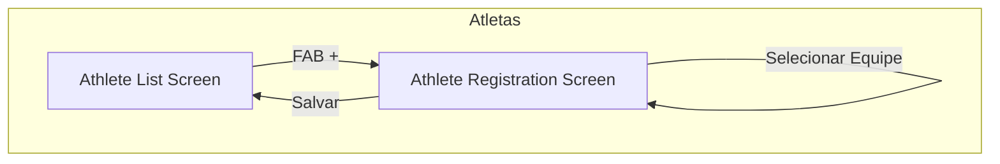
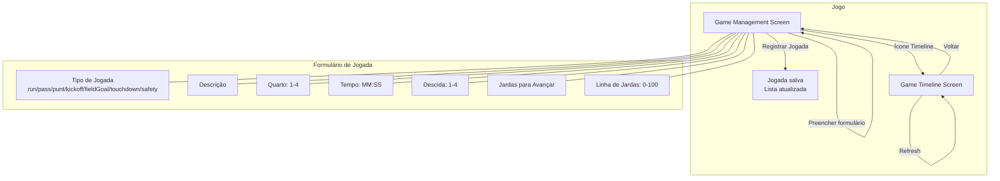
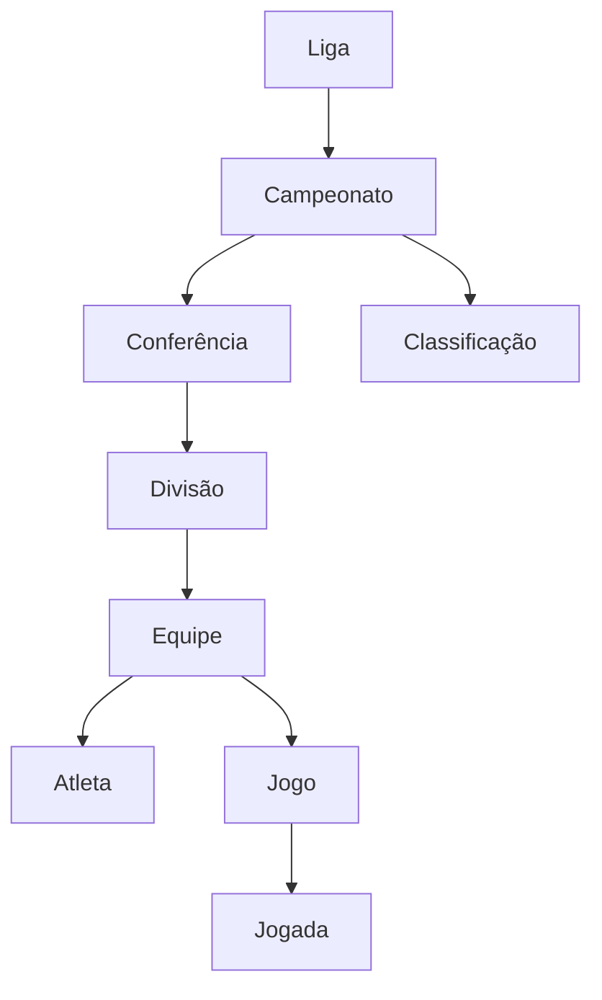

# America App — Fluxos de Telas

> Documento de referência para visualização dos fluxos de navegação do app.
> Os diagramas usam sintaxe Mermaid, compatível com Figma (plugin "Mermaid to Figma"),
> FigJam, draw.io, e visualizadores online como [mermaid.live](https://mermaid.live).

---

## Visão Geral da Navegação



---

## Fluxo de Autenticação



---

## Fluxo da Home + Drawer

```mermaid
flowchart LR
    subgraph Home
        HOME[Home Screen\n"Bem-vindo ao America App!"]
        APPBAR[AppBar: America App]
        LOGOUT[🚪 Botão Logout]
    end

    subgraph Drawer["Menu Lateral (Drawer)"]
        HEADER[DrawerHeader\n"Menu"]
        M1[⚽ Ligas]
        M2[🏆 Campeonatos]
        M3[🤝 Conferências]
        M4[📊 Divisões]
        M5[👥 Equipes]
        M6[🏃 Atletas]
        M7[📈 Classificação]
    end

    HOME --- APPBAR
    APPBAR --- LOGOUT
    HOME --- HEADER
    HEADER --- M1
    HEADER --- M2
    HEADER --- M3
    HEADER --- M4
    HEADER --- M5
    HEADER --- M6
    HEADER --- M7
```

---

## Fluxo CRUD — Campeonatos



---

## Fluxo CRUD — Conferências



---

## Fluxo CRUD — Divisões



---

## Fluxo CRUD — Equipes



---

## Fluxo CRUD — Atletas



---

## Fluxo de Gerenciamento de Jogo



---

## Fluxo de Classificação (Standings)

```mermaid
flowchart TD
    subgraph Classificação
        S[Standings Screen] -->|Carrega| SL{Estado}
        SL -->|Loading| SP[⏳ CircularProgressIndicator]
        SL -->|Error| SE[❌ Mensagem de erro]
        SL -->|Vazio| SV[📭 "Nenhuma classificação disponível"]
        SL -->|Dados| ST[📊 Tabela\nTime | V | D | Pts]
    end
```

---

## Hierarquia de Entidades



---

## Inventário de Telas

| # | Tela | Arquivo | Tipo |
|---|------|---------|------|
| 1 | Login | `ui/auth/views/login_screen.dart` | Formulário |
| 2 | Cadastro | `ui/auth/views/signup_screen.dart` | Formulário |
| 3 | Home | `ui/home/views/home_screen.dart` | Dashboard + Drawer |
| 4 | Cadastro de Liga | `ui/league/views/league_registration_screen.dart` | Formulário |
| 5 | Lista de Campeonatos | `ui/championship/views/championship_list_screen.dart` | Lista |
| 6 | Cadastro de Campeonato | `ui/championship/views/championship_registration_screen.dart` | Formulário |
| 7 | Lista de Conferências | `ui/conference/views/conference_list_screen.dart` | Lista |
| 8 | Cadastro de Conferência | `ui/conference/views/conference_registration_screen.dart` | Formulário |
| 9 | Lista de Divisões | `ui/division/views/division_list_screen.dart` | Lista |
| 10 | Cadastro de Divisão | `ui/division/views/division_registration_screen.dart` | Formulário |
| 11 | Lista de Equipes | `ui/team/views/team_list_screen.dart` | Lista |
| 12 | Cadastro de Equipe | `ui/team/views/team_registration_screen.dart` | Formulário |
| 13 | Lista de Atletas | `ui/athlete/views/athlete_list_screen.dart` | Lista |
| 14 | Cadastro de Atleta | `ui/athlete/views/athlete_registration_screen.dart` | Formulário |
| 15 | Gerenciamento de Jogo | `ui/game/views/game_management_screen.dart` | Formulário + Lista |
| 16 | Timeline do Jogo | `ui/game/views/game_timeline_screen.dart` | Lista |
| 17 | Classificação | `ui/standings/views/standings_screen.dart` | Tabela |

---

## Como usar este documento

### Figma
1. Instale o plugin **"Mermaid to Figma"** no Figma
2. Copie qualquer bloco de código Mermaid deste documento
3. Cole no plugin para gerar o diagrama visual
4. Ajuste cores e layout conforme necessário

### FigJam
1. Use o widget **Mermaid** disponível no FigJam
2. Cole os diagramas diretamente

### draw.io / diagrams.net
1. Acesse [draw.io](https://app.diagrams.net/)
2. Use Extras → Edit Diagram e cole o código Mermaid
3. Ou use o formato de importação Mermaid

### Mermaid Live Editor
1. Acesse [mermaid.live](https://mermaid.live)
2. Cole qualquer diagrama para visualização e exportação como PNG/SVG

### VS Code
1. Instale a extensão **"Markdown Preview Mermaid Support"**
2. Abra este arquivo e use o preview do Markdown
